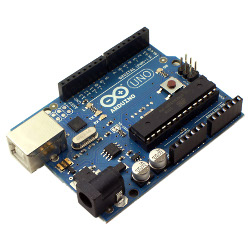
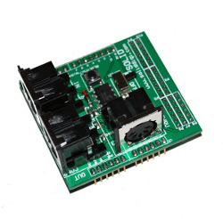
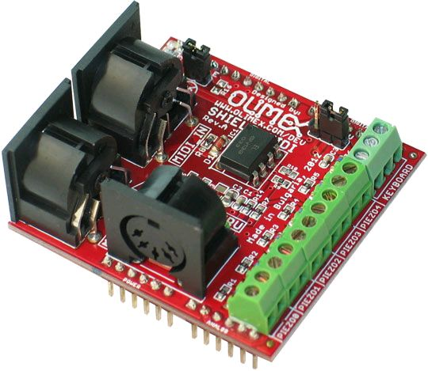
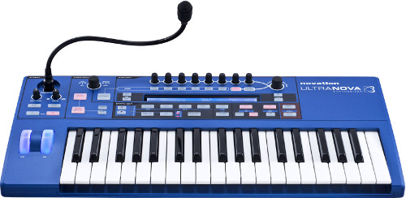

This is an arduino project for automated octave switching.
Run it as a proxy between midi out and midi in (can be done with only one keyboard on keyboards that let you disable local keys, like a Novation UltraNova).

The end result is kind of like manual arpeggiation.  It lets you do
extremely fast (as in, you might possibly outrun the hardware!) scale
and arpeggio runs.  It isn't clock based, and doesn't make guesses.
It only plays notes you actually play, but octave switches to the nearest note to the previous note.  In practice it means that jumps up of a fifth or more shift octave down, and jumps down of a fifth or more shift an octave up.

In THIS branch, the keyboard is a quartertone flat below middle C, and designed exclusively for playing mono voices.

Demonstration Video:

https://www.youtube.com/watch?v=IfWY_6Q8RX4

To build one, install the Arduino SDK:

http://www.arduino.cc

Buy an Arduino Uno, easily available from electronics stores for as low as $5:

Buy a MIDI shield for roughly $20.  You typically need to buy them online.  I find them on Amazon (Olimex, LinkSprite).  You only need MIDI IN and OUT for these purposes (you can buy a partial MIDI shield that doesn't have a MIDI THRU, with only IN and OUT if you like):

Stack them together.  Be very careful to align the pins correctly before plugging into USB (ie: the power source), or you can damage the board.  Then use the Arduino SDK to upload octaveRounder.ino into the Arduino boardi over the USB.

As always with MIDI, make sure that the keyboard is set to transmit MIDI out (usually on channel 1).  Then MIDI OUT from that keys controller into the MIDI IN of the MIDI Shield, and MIDI OUT from the Shield into the MIDI IN of the synth.  If your MIDI keys controller has a disable local keys option, use that.  If you can disable local keys, you can use the same device for keys controller and synth.  I use a Novation UltraNova for this purpose:

